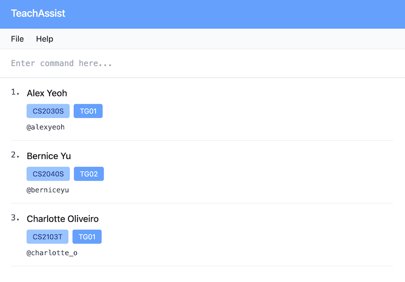

# Target User  
TeachAssist is designed for full-time university teaching assistants who manage multiple classes and tutorials each semester. 

# Value Proposition 
TeachAssist helps university teaching assistants streamline their administrative tasks, allowing them to efficiently manage student information and stay organized across multiple classes. The system supports a fast, typing-based interface to help them stay on top of their daily responsibilities.
