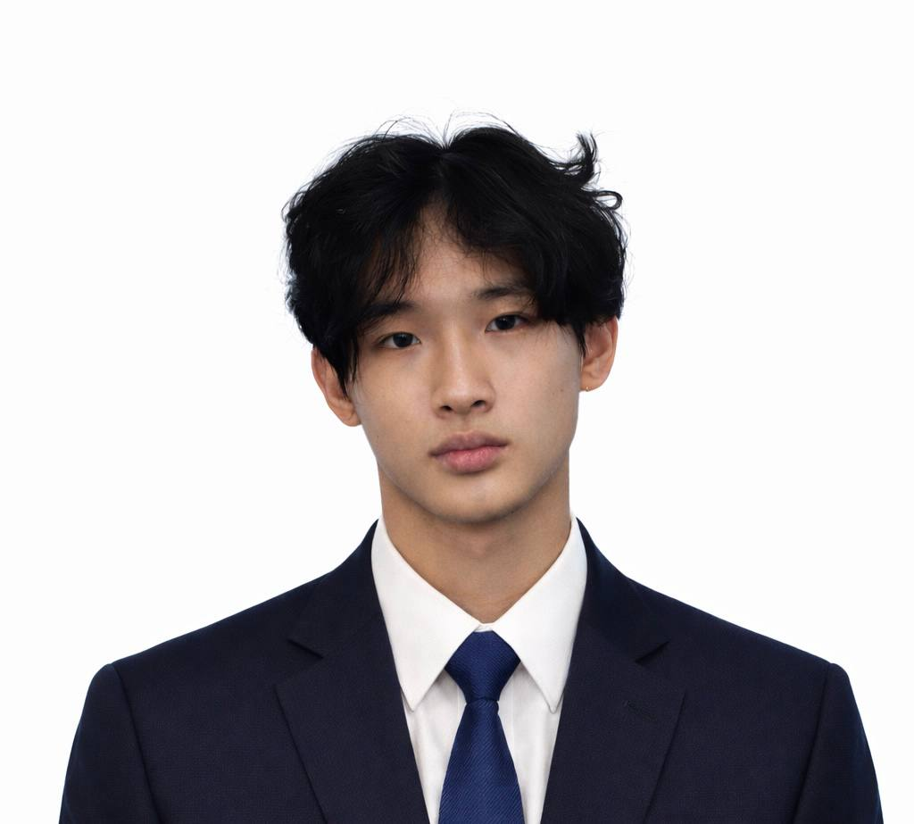
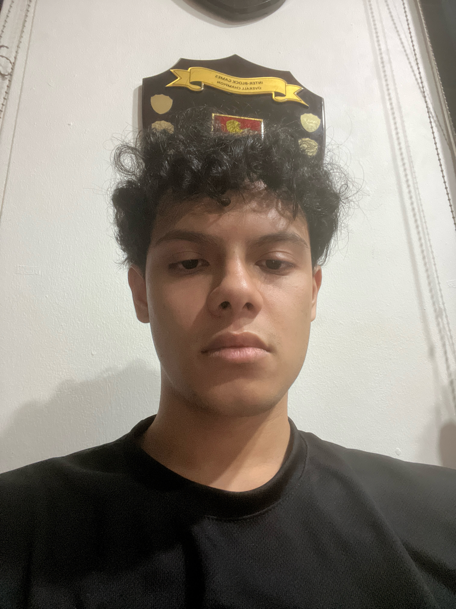

# About Us

We are a team based in the [School of Computing, National University of Singapore](http://www.comp.nus.edu.sg).

You can reach us at the email `seer[at]comp.nus.edu.sg`

## Project team

### Isha Sovasaria

[[github](https://github.com/Isha-Sovasaria)]

* Role: Team lead

* Responsibilities:In-charge of Deliverables and Deadlines , Scheduling and tracking , Git expert

### Chen Guanyou

[[github](https://github.com/guanyouu)]

* Role: Code Quality / Integration Supervisor

### Hyder

[[github](http://github.com/amir-hyder)]

* Role: Developer
* Responsibilities: Testing

### Ashutosh Menon Rajeev

[[github](https://github.com/poaoaooa)]

* Role: Developer
* Responsibilities: Developer's Guide

### Ariel Chua

[[github](http://github.com/arielchua)]

* Role: Developer
* Responsibilities: Documentation and User Guide
