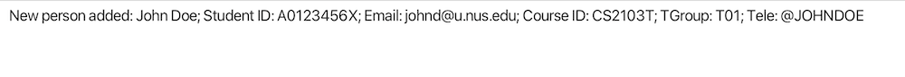
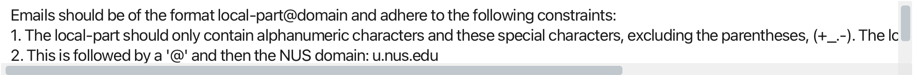
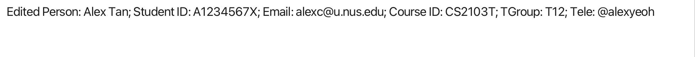
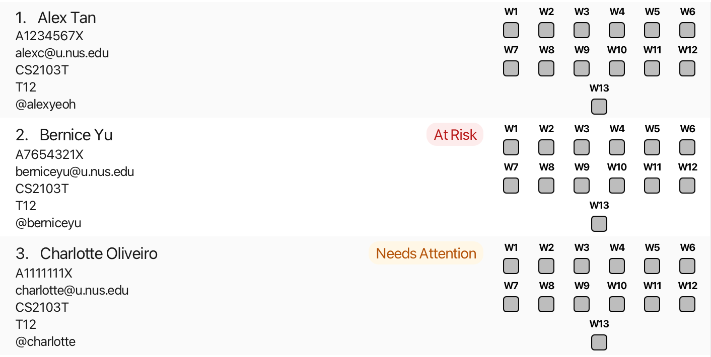
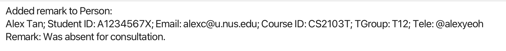
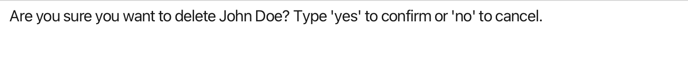

# TeachAssist User Guide

Are you tired of juggling multiple platforms—tracking tutorials, managing attendance and progress, and keeping track of endless student records? Do you find yourself struggling with clunky spreadsheets and endless menus? TeachAssist is for you.

TeachAssist is a desktop application designed for full-time University Teaching Assistants (TAs) at NUS who manage multiple classes and tutorials each semester.If you're a fast typist, TeachAssist can help you quickly filter student lists, track attendance, and log important notes using straightforward keyboard commands, all while offering an easy-to-navigate visual interface.

And the best part? No technical expertise needed—just basic computer skills like installing software and navigating files.

## Table of contents
- [Quick start](#quick-start)
- [Features](#features)
  - [Viewing help: `help`](#help)
  - [Listing all students: `list`](#list)
  - [Adding a student: `add`](#add)
  - [Finding students by name: `find`](#find)
  - [Filtering students: `filter`](#filter)
  - [Editing a student: `edit`](#edit)
  - [Updating students' attendance](#attendance)
    - [Marking a student's attendance: `markattendance`](#mark-attendance)
    - [Cancelling a tutorial's week: `cancelweek`](#cancel-week)
    - [Uncancelling a tutorial's week: `uncancelweek`](#uncancel-week)
  - [Updating a student's progress: `updateprogress`](#update-progress)
  - [Remarks](#remarks)
    - [Adding a remark: `remark`](#remark)
    - [Deleting a remark: `unremark`](#unremark)
  - [Viewing a student: `view`](#view)
  - [Deleting a student: `delete`](#delete)
    - [Delete by index](#deletebyindex)
    - [Delete by student details](#deletebydetails)
  - [Clearing all students: `clear`](#clear)
  - [Exiting the app: `exit`](#exit)
  - [Saving the data](#saving-the-data)
  - [Known Issues](#known-issues)
- [Command Summary](#command-summary)
- [FAQ](#faq)
---
## Quick start

Can't wait to get TeachAssist up and running? Let’s begin!

1. **Ensure that Java 17 or above is installed on your computer.**<br>

   > **To check your Java version:**
   > 1. Open a command terminal on your computer.
   > 2. Type `java -version` and press Enter.
   > 3. Look at the first number in the version shown. It should be `17` or higher.
   >
   > Example:
   > ```bash
   > java -version
   > ```
   > ```bash
   > java version "17.0.1"
   > ```
   >
   > **If Java is not installed, or your version is below 17:**
   > - Install Java 17 using the guide for your operating system:
   >   - [Windows](https://se-education.org/guides/tutorials/javaInstallationWindows.html)
   >   - [Mac](https://se-education.org/guides/tutorials/javaInstallationMac.html)
   >   - [Linux](https://se-education.org/guides/tutorials/javaInstallationLinux.html)
   > - After installation, restart your terminal and run `java -version` again to confirm that the correct version is installed.
  

2. **Download the latest `TeachAssist.jar` file** from the [Releases page](https://github.com/AY2526S2-CS2103T-F10-3/tp/releases/tag/v1.3).

3. **Move the downloaded file into a folder you want to use as the TeachAssist home folder.**  
   This folder will be used to store the app and its data.
   
   Example:
   - You may create a folder named `TeachAssist` on your Desktop.
   - Then move `TeachAssist.jar` into that folder.

4. **Open a terminal in that folder.**
   - Navigate to the folder containing `TeachAssist.jar`.
   - For example, if your folder is named `TeachAssist`, type:
     ```bash
     cd TeachAssist
     ```

5. **Run the application** by entering:
   ```bash
   java -jar TeachAssist.jar
   ```

   After a few seconds, the GUI should appear, similar to the screenshot below.  
   Notice that the app starts with some sample data for you to try out the commands.

   

6. **Try entering a command in the command box.**  
   A good place to start is help. Type it in and press Enter to open the help window and view the list of available commands.

7. **Try these example commands:**
   - `help` : Opens the help window.
   - `list` : Lists all students.
   - `delete 3` : Deletes the student at index `3` in the current list.
   - `add n/John Doe id/A0123456X e/johnd@u.nus.edu crs/CS2103T tg/T01 tel/@johndoe` : Adds a student named `John Doe`.
   - `clear` : Deletes all students.
   - `exit` : Exits the app.

8. **Refer to the [Features](#features) section below** for the full list of commands and detailed usage instructions.

You’re all set! From here, head to the Features section to learn what TeachAssist can do.

---

## Features

<a name="help"></a>
### Viewing help : `help`

Need a quick reminder of how TeachAssist works? Use the `help` command to open the Help Window, which gives you a summary of available commands and a direct link to the User Guide.

**Format:**
```
help
```

The following pop-up should show:


<box type="tip">
**Tip**:
    You can also press `F1` to open the Help Window.
</box>

<a name="list"></a>
### Listing all students: `list`

If you want to see every student currently stored in TeachAssist, use the `list` command to display the full student list in alphabetical order.

This is especially useful after using commands such as [`find`](#find) or [`filter`](#filter), when you want to return to the complete list!

**Format:**
```
list
```


<a name="add"></a>
### Adding a student: `add`

Let's begin adding students! 

Use the `add` command to create a student record with their key details, such as name, student ID, email, course, and tutorial group. This is useful when setting up your class list at the start of the semester or when adding students later on.

**Format:**
```
add n/NAME id/STUDENT_ID e/EMAIL crs/COURSE_ID tg/TUTORIAL_GROUP [tel/TELEGRAM_USERNAME]
```

Parameter Constraints:
* `NAME` should ...
* ..... add on

<box type="warning"> 
**Warning**:
    What makes a student a duplicate?
    A student cannot be added if another student with the same 3 parameters `STUDENT_ID`, `COURSE_ID`, and `TUTORIAL_GROUP` already exists in TeachAssist. 
</box>

**Examples:**
```
add n/JOHN DOE id/A0123456X e/johnd@u.nus.edu crs/CS2103T tg/T01 tel/@JOHNDOE
```

When a student is added successfully, you will receive a confirmation message:



If any required fields are missing or the index is wrong, an error will be shown:

i.e. If you use an email domain that isnt @u.nus.edu:



<a name="find"></a>
### Finding students by name: `find`

Let's be real, the list of students gets long, and it's tough to keep scrolling to find a student.
That's why we have the `find` command! It helps you instantly locate students using the **beginning of any word in their name**.

Format: `find KEYWORD [MORE_KEYWORDS]...`

**Search Rules:**
* The search is case-insensitive. e.g. `hans` matches `Hans`
* The order of keywords does not matter. e.g. `Hans Bo` matches `Bo Hans`
* Only the name field is searched
* Keywords match the **start of words** in names (prefix matching).Substrings in the middle of words are not matched.
    * e.g. `Han` matches `Hans`
    * `an` will not match `Hans`
* If you provide multiple keywords, TeachAssist will find students that match any of them (e.g., find Al Bob finds both Albert and Bobby)

**Example:** 

`find jo doe` — Finds **Jo**hn **Doe** and **Jo**anne **Doe**bertson.

**Expected Output:**

The student list updates instantly to show only matching records, and the Result Box (see Figure X) displays the total count of students found.

<box type="warning">
**Warning**: 
    Keywords must be alphabetic only (A–Z). Using numbers or symbols (e.g., `find A123`) will result in an error.
</box>

<box type="info">
**Note**: 
    The `find` command searches through the entire stored student list and replaces any existing filter — it does not apply on top of a previously displayed (filtered) list.
</box>


<a name="filter"></a>
### Filtering students: `filter`

Narrow down your student list by Course ID, Tutorial Group, Progress, or Absence count. This is the most efficient way to identify "at-risk" students or specific tutorial sections.

**Format:**
```
filter [crs/COURSE_ID] [tg/TUTORIAL_GROUP] [p/PROGRESS] [abs/ABSENCE_COUNT]`
```

Behaviour:
* Course ID (`crs/`) and tutorial group (`tg/`) are matched case-insensitively.
* Progress (`p/`) must be one of the following(case-insensitive): `on_track`, `needs_attention`, `at_risk`, or `clear` (alias `not_set`).
* Absence count (`abs/`) matches students whose absence count is greater than or equal to the provided number.
* Multiple filters combine with AND semantics — a student must satisfy every provided filter to be included in the results.

<box type="warning">
**Warning**: 
    At least one filter parameter must be provided; using no parameters will result in an error.
</box>

<box type="info">
**Note**: 
    The `filter` command applies to the entire stored student list and replaces any existing filter — it does not apply on top of a previously displayed (filtered) list.
</box>

**Examples:**

Examples:
- `filter crs/CS2103T tg/T01` — shows students in `CS2103T` tutorial group `T01`.
- `filter p/on_track` — shows students whose progress is `on_track`.
- `filter abs/2` — shows students with 2 or more absences.
- `filter crs/CS2103T tg/T02 p/needs_attention abs/1` — shows students in `CS2103T` tutorial group `T02` whose progress is `needs_attention` and who have at least 1 absence.

**Expected Output:**

The student list updates instantly. The Result Box will display the total count:

`There are 5 students matching this filter.`

<box type="tip">
**Tip**: 
    If a filter returns no results, verify you used the correct course ID/tutor group format and valid progress values; run `help` or check the Update Progress section for exact progress tokens.
</box>

<a name="edit"></a>
### Editing a student: `edit`

Use this command to update one or more details of an existing student based on their index in the currently displayed list.

**Format:** 
```
edit INDEX [n/NAME] [id/STUDENT_ID] [e/EMAIL] [crs/COURSE_ID] [tg/TUTORIAL_GROUP] [tel/TELEGRAM_USERNAME]
```

- `INDEX` refers to the index number shown in the currently displayed student list and must be a positive integer `1`, `2`, `3`, …
- At least one optional field must be provided. Any number of fields can be updated in a single command.
- Only the fields you specify will be updated — all other details remain unchanged.

**Examples:**

- `edit 1 n/John Hoe` — updates the name of the 1st student to `John Hoe`.
- `edit 2 e/johnd@example.com tg/T02` — updates the email and tutorial group of the 2nd student.
- `edit 3 n/Alex Yeoh id/A1234567X tel/alexyeoh` — updates the name, student ID, and Telegram username of the 3rd student.

The student list updates immediately to reflect the changes. The Result Box will confirm the edit with the updated student's details.



<a name="attendance"></a>
### Updating students' attendance

After setting up your student list, the next thing you will likely do throughout the semester is keep attendance records updated. You may be marking one student's attendance for a particular week, or handling a tutorial session that was cancelled for the whole class.
TeachAssist provides three attendance-related commands. Use `markattendance` to update an individual student's attendance for a specific week, `cancelweek` to cancel a tutorial week for an entire class, and `uncancelweek` to restore a previously cancelled week.

<box type="info">
**Note**:
    In line with the NUS academic calendar, each student added to TeachAssist starts with a default attendance record covering 13 teaching weeks. These weekly records can then be updated, cancelled, or restored using the attendance commands below.
</box>

<a name="mark-attendance"></a>
#### Marking a student's attendance: `markattendance`

Use this command to update the attendance of a specific student for a specific week.

Supported attendance statuses:
- `y` for present
- `a` for absent
- `n` for unmarked

**Format:** 
```
markattendance INDEX week/WEEK sta/STATUS
```

* Updates the attendance of student at the specified `INDEX` and `WEEK` to `STATUS`.
* The index refers to the index number shown in the currently displayed student list.
* The index **must be a positive integer** 1, 2, 3, …


**Examples**:

- `markattendance 1 week/3 sta/y` - marks the attendance of the 1st student's attendance in week 3 as present -> Green.

- `markattendance 2 week/6 sta/a` - marks the attendance of the 2nd student's attendance in week 6 as absent -> Red.

- `markattendance 4 week/4 sta/n` - marks the attendance of the 4th student's attendance in week 4 as unmarked -> Grey.

**Expected output:**

The selected student's attendance record is updated immediately in the student list, and the corresponding week is shown with the updated attendance status.
mark

The following shows week 3 marked as present for Alex Tan, week 6 marked as absent for Bernice Yu, and unmarked for everything else.


<a name="cancel-week"></a>
#### Cancelling a tutorial's week: `cancelweek`

Sometimes, a tutorial may not take place for a particular week, for example due to a public holiday, a make-up arrangement, or a planned cancellation. In such cases, use the `cancelweek` command to mark that week as cancelled for all students in a specific course and tutorial group.

**Format:** 

`cancelweek crs/COURSE_ID tg/TUTORIAL_GROUP week/WEEK`

* Cancels the specified `WEEK` for **all students** in the matching `COURSE_ID` and `TUTORIAL_GROUP`.
* A cancelled week will be reflected in each student’s attendance record.
* If the week is already cancelled, the command will have no additional effect.

<box type="info">
**Note**:
    The cancellation is applied to:
        - All existing students in that course and tutorial group.
        - All future students added to the same course and tutorial group.
</box>

**Example:**

- `cancelweek crs/CS2103T tg/T12 week/5` — cancels week 5 for all students in course `CS2103T` and tutorial group `T12can`.

**Expected output:**

All matching students will show week 5 as cancelled (represented by an X) in their attendance records.


<a name="uncancel-week"></a>
#### Uncancelling a tutorial's week: `uncancelweek`

Use this command to restore a previously cancelled tutorial week for all students in a specific course and tutorial group.

**Format:** 
```
uncancelweek crs/COURSE_ID tg/TUTORIAL_GROUP week/WEEK
```

* Removes the cancelled status for the specified `WEEK`.
* The week will return to a normal attendance state for all students in the matching course and tutorial group.
* This affects:
    * Existing students (their week status will be updated).
    * Future students (the week will no longer be auto-marked as cancelled).
* If the week was not previously cancelled, the command will have no effect.

**Example:**

- `uncancelweek crs/CS2103T tg/T12 week/5` — restores week 5 as a normal week for all students in course `CS2103T` and tutorial group `T12`.

<a name="update-progress"></a>
### Updating a student's progress : `updateprogress`

Need to quickly flag a student who is doing well, falling behind, or needs closer follow-up? Use `updateprogress` to keep that status up to date.

**Format:**
```
updateprogress INDEX p/PROGRESS
```

* Updates the progress of the student at the specified `INDEX`.
* The index refers to the index number shown in the currently displayed student list.
* The index **must be a positive integer** `1`, `2`, `3`, …
* Supported progress values:
  * `on_track`
  * `needs_attention`
  * `at_risk`
  * `not_set`
* Progress is case-insensitive, so values such as `ON_TRACK` and `on_track` are both accepted.

<box type="tip">
**Tip**: 
    To remove a student's progress tag, use `not_set`.
</box>

**Examples:**

- `updateprogress 1 p/not_set` - clear the 1st student's progress by setting it to  `not_set`
- `updateprogress 2 p/at_risk` - set the 2nd student's progress to `at_risk`
- `updateprogress 3 p/needs_attention` - set the 3rd student's progress to `needs_attention`

**Expected output:**




### Remarks

<a name="remark"></a>
#### Adding a remark : `remark`

Need to record an important note about a student? Use the `remark` command to attach a remark directly to that student’s record! Keep track of class participation, proficiency in topics, or just general remarks of a student!

**Format:**
```
remark INDEX txt/REMARK
```

* The remark must be prefixed with `txt/`.
* If multiple `txt/` prefixes are provided, only the first `txt/` is treated as a prefix, subsequent `txt/` prefixes will be treated as part of the remark
* Each remark is limited to a 100 characters. Keep your remarks concise!
* Each remark is automatically tagged with the date it was added.
* A student can have multiple remarks attached to their record.

<box type="warning">
**Warning**: 
    If multiple `txt/` prefixes are provided, only the first `txt/` is treated as a prefix, subsequent `txt/` prefixes will be treated as part of the remark.
    e.g. `remark 1 txt/Needs more practice on txt/recursion` will be stored as the remark `Needs more practice on txt/recursion`
</box>

**Examples:**

- `remark 1 txt/Participates actively in class!`
- `remark 1 txt/Shows steady improvements.`
- `remark 1 txt/Was absent for consultation.`

**Expected output:**

The selected student's record is updated with the new remark, and the Result Box displays a confirmation message. 
To view all existing remarks of a student, go to [View](#view).
Remarks are shown when you select that student, allowing you to view the newly added remark together with any existing remarks.




<a name="unremark"></a>
#### Removing a remark : `unremark`

Over time, some remarks may become outdated, unnecessary, or incorrect. The `unremark` feature lets you delete a specific remark from a student’s record when it is no longer useful.

**Format:**

```
unremark INDEX r/REMARK_INDEX
```
- Removes the remark at `REMARK_INDEX` from the student at the specified `INDEX`.
- The index refers to the index number shown in the currently displayed student list.
- The remark index refers to the position of the remark in that student's remark list.
- Both `INDEX` and `REMARK_INDEX` must be positive integers 1, 2, 3, …

**Examples:**

- `unremark 1 r/2` - removes the 2nd remark for the 1st student on the list.


<a name="view"></a>
### Viewing a student: `view`

When you want to see a student's full details, including their remarks, use the `view` command to display that student's information in the View Window. You can also click on a student in the list to view their details.

**Format:**
```
view INDEX
```
**Example:** 

`view 1` — Displays the full details of the 1st student on the currently displayed list.

**Expected Output:**

The **View Window** on the right side of the application updates to show the selected student's details. A confirmation message also appears in the Result Box:


<a name="delete"></a>
### Deleting a student: `delete`

Need to permanently remove a student record? TeachAssist lets you do this in two ways. The usual method is to delete by index when the student is already visible in the current list. If needed, you can also delete by the student’s stored details.

<a name="deletebyindex"></a>
#### Delete by index

Use this when the student is already shown in the current list and you want the fastest way to remove them.

**Format:**
```
delete INDEX
```

* Deletes the student at the specified `INDEX`.
* The index refers to the index number shown in the currently displayed student list.
* The index **must be a positive integer** `1`, `2`, `3`, …

**Confirmation prompt**

After you enter a valid `delete` command, TeachAssist will show a confirmation message.

You should see this confirmation message shown after a valid `delete` command:



Enter `yes` to proceed with the deletion, or `no` to cancel it.

**Examples:**

- `delete 1` followed by `yes` - deletes the 1st student in the currently displayed student list.
- `delete 3` followed by `no` - no change is made.

**Expected outcome:**

If the deletion is confirmed, TeachAssist will display a success message so you know the student has been successfully removed.


Did you get it? If you did, congrats!

<a name="deletebydetails"></a>
#### Delete by student details

Need a more precise alternative? You can also delete a student by specifying their student ID, course ID, and tutorial group instead of relying on list position.

**Format:**
```
delete id/STUDENT_ID crs/COURSE_ID tg/TUTORIAL_GROUP
```

* Deletes the student with the exact matching `STUDENT_ID`, `COURSE_ID`, and `TUTORIAL_GROUP`.
* The same confirmation flow applies: enter `yes` to confirm or `no` to cancel.

**Example:**

- `delete id/A1234567X crs/CS2103T tg/T01` followed by `yes` - deletes the student with student ID `A1234567X`, course `CS2103T`, and tutorial group `T01`.

<box type="info">
**Note**:
    This method searches the **entire TeachAssist list**, not just the students currently displayed. This means a student can still be deleted even if they are currently hidden by a filter.
</box>

<a name="clear"></a>
### Clears all students : `clear`

Deletes all students. Useful for when the semester ends and you want to prep TeachAssist for the next! 

Format:
```
clear
```

<a name="exit"></a>
### Exiting the program : `exit`

Closes TeachAssist. But don't worry, your data will be kept safe.

Format:
```
exit
```

### Saving the data

TeachAssist data are saved in the hard disk automatically after any command that changes the data. There is no need to save manually.

### Known issues

1. Cancelled-week recovery is transient: When a week is cancelled, the app stores previous per-student attendance statuses in memory to allow in-session recovery. However, this transient state is not persisted to disk. As a result, after the application is closed and restarted, recovering the pre-cancellation Y/A/N statuses may not be possible. Consider this when cancelling weeks; if you need to retain historical statuses across restarts, avoid relying on the transient recovery mechanism.


--------------------------------------------------------------------------------------------------------------------

## Command Summary

Action | Format, Examples
-------|----------------------------------------------------------------------------------------------------------------------------------------------------------------------------------------------------
**Help** | `help`
**List** | `list`
**Add** | `add n/NAME id/STUDENT_ID e/EMAIL crs/COURSE_ID tg/TUTORIAL_GROUP [tel/TELEGRAM_USERNAME]`<br> e.g., `add n/John Doe id/A0123456X e/johnd@u.nus.edu crs/CS2103T tg/T01 tel/@johndoe`
**Find** | `find KEYWORD [MORE_KEYWORDS]...`<br> e.g., `find John Tan`
**Filter** | `filter [crs/COURSE_ID] [tg/TUTORIAL_GROUP] [p/PROGRESS] [abs/ABSENCE_COUNT]`<br> e.g., `filter crs/CS2103T tg/T02 p/needs_attention abs/1`
**Edit** | `edit INDEX [n/NAME] [id/STUDENT_ID] [e/EMAIL] [crs/COURSE_ID] [tg/TUTORIAL_GROUP] [tel/TELEGRAM_USERNAME]`<br> e.g., `edit 2 e/johndoe@u.nus.edu tg/T03`
**Mark Attendance** | `markattendance INDEX week/WEEK sta/STATUS`<br> e.g., `markattendance 1 week/3 sta/y`
**Cancel Week** | `cancelweek crs/COURSE_ID tg/TUTORIAL_GROUP week/WEEK`<br> e.g., `cancelweek crs/CS2103T tg/T12 week/5`
**Uncancel Week** | `uncancelweek crs/COURSE_ID tg/TUTORIAL_GROUP week/WEEK`<br> e.g., `uncancelweek crs/CS2103T tg/T12 week/5`
**Update Progress** | `updateprogress INDEX p/PROGRESS`<br> e.g., `updateprogress 1 p/on_track`
**Remark** | `remark INDEX txt/REMARK`<br> e.g., `remark 1 txt/Participates actively in class!`
**Unremark** | `unremark INDEX r/REMARK_INDEX`<br> e.g., `unremark 1 r/2`
**View** | `view INDEX`<br> e.g., `view 1`
**Delete** | `delete INDEX`<br> e.g., `delete 3`<br> or `delete id/STUDENT_ID crs/COURSE_ID tg/TUTORIAL_GROUP`<br> e.g., `delete id/A1234567X crs/CS2103T tg/T01`
**Clear** | `clear`
**Exit** | `exit`

--------------------------------------------------------------------------------------------------------------------

## FAQ

**Q: Do I need to enter parameters in a fixed order?**
No. For commands with prefixes such as add and filter, parameters can be entered in any order as long as all required fields are provided.

**Q: Why did delete 1 remove a different student than I expected?**
Because the index refers to the current displayed list. You may be referring to an outdated list.
