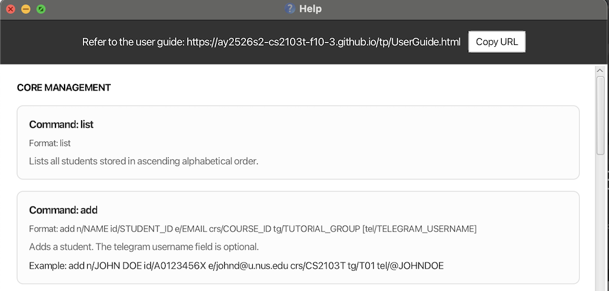
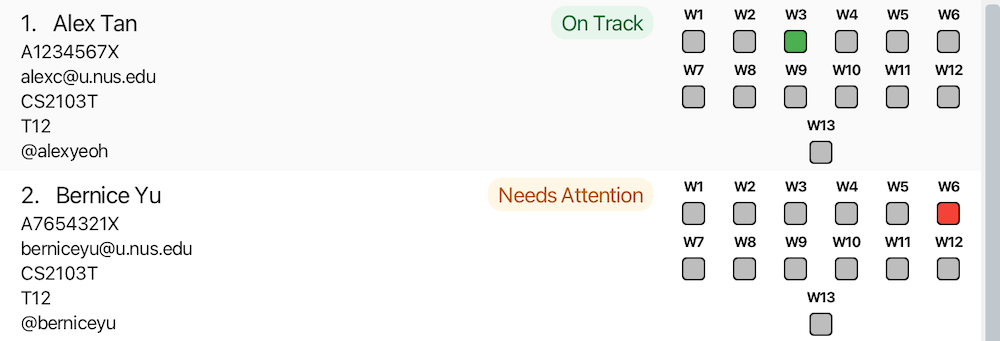
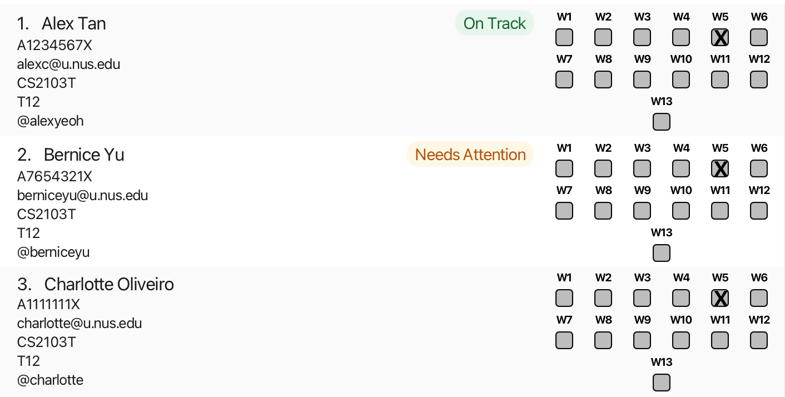
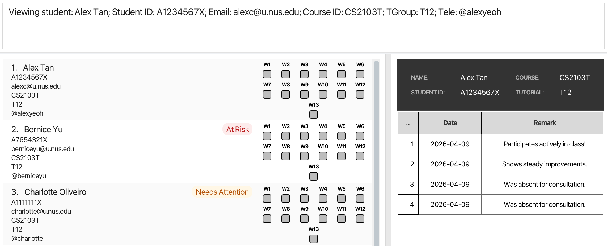

# TeachAssist User Guide

Are you tired of juggling multiple platforms—tracking tutorials, managing attendance and searching through endless student records? Do you find yourself struggling with clunky spreadsheets and endless menus?

**TeachAssist** is for you.

TeachAssist is a desktop application designed for **full-time University Teaching Assistants (TAs) at NUS** who manage multiple classes and tutorials each semester.If you're a fast typist, TeachAssist can help you quickly filter student lists, track attendance, and log important notes using straightforward keyboard commands, all while offering an easy-to-navigate visual interface.

And the best part? No technical expertise needed—just basic computer skills like installing software and navigating files.

## Table of contents
- [Quick start](#quick-start)
- [Features](#features)
  - [Viewing help: `help`](#help)
  - [Listing all students: `list`](#list)
  - [Adding a student: `add`](#add)
  - [Finding students by name: `find`](#find)
  - [Filtering students: `filter`](#filter)
  - [Editing a student: `edit`](#edit)
  - [Updating students' attendance](#attendance)
    - [Marking a student's attendance: `marka`](#mark-attendance)
    - [Cancelling a tutorial's week: `cancelw`](#cancel-week)
    - [Uncancelling a tutorial's week: `uncancelw`](#uncancel-week)
  - [Updating a student's progress: `updateprogress`](#update-progress)
  - [Remarks](#remarks)
    - [Adding a remark: `remark`](#remark)
    - [Deleting a remark: `unremark`](#unremark)
  - [Viewing a student: `view`](#view)
  - [Deleting a student: `delete`](#delete)
    - [Delete by index](#deletebyindex)
    - [Delete by student details](#deletebydetails)
  - [Clearing all students: `clear`](#clear)
  - [Exiting the app: `exit`](#exit)
  - [Saving the data](#saving-the-data)
  - [Editing the data](#editing-the-data)
- [Command Summary](#command-summary)
- [Parameter Summary](#parameter-summary)
- [Known Issues](#known-issues)
- [FAQ](#faq)
- [Glossary](#glossary)
---

## Quick start

Can't wait to get TeachAssist up and running? Let’s begin!

1. **Ensure that Java 17 or above is installed on your computer.**<br>

   > **To check your Java version:**
   > 1. Open a command terminal on your computer.
   > 2. Type `java -version` and press Enter.
   > 3. Look at the first number in the version shown. It should be `17` or higher.
   >
   > Example:
   > ```bash
   > java -version
   > ```
   > ```bash
   > java version "17.0.1"
   > ```
   >
   > **If Java is not installed, or your version is below 17:**
   > - Install Java 17 using the guide for your operating system:
   >   - [Windows](https://se-education.org/guides/tutorials/javaInstallationWindows.html)
   >   - [Mac](https://se-education.org/guides/tutorials/javaInstallationMac.html)
   >   - [Linux](https://se-education.org/guides/tutorials/javaInstallationLinux.html)
   > - After installation, restart your terminal and run `java -version` again to confirm that the correct version is installed.


2. **Download the latest `TeachAssist.jar` file** from the [Releases page](https://github.com/AY2526S2-CS2103T-F10-3/tp/releases/tag/v1.3).

3. **Move the downloaded file into a folder you want to use as the TeachAssist home folder.**
   This folder will be used to store the app and its data.

   Example:
   - You may create a folder named `TeachAssist` on your Desktop.
   - Then move `TeachAssist.jar` into that folder.

4. **Open a terminal in that folder.**
   - Navigate to the folder containing `TeachAssist.jar`.
   - For example, if your folder is named `TeachAssist`, type:
     ```bash
     cd TeachAssist
     ```

5. **Run the application** by entering:
   ```bash
   java -jar TeachAssist.jar
   ```

   After a few seconds, the GUI should appear, similar to the screenshot below.
   Notice that the app starts with some sample data for you to try out the commands.

    

6. **Try entering a command in the command box.**
   A good place to start is help. Type it in and press Enter to open the help window and view the list of available commands.

7. **Try these example commands:**
   - `help` : Opens the help window.
   - `list` : Lists all students.
   - `delete 3` : Deletes the student at index `3` in the current list.
     - Upon request for confirmation, enter `yes` to confirm deletetion.
   - `add n/John Doe id/A0123456X e/johnd@u.nus.edu crs/CS2103T tg/T01 tel/@johndoe` : Adds a student named `John Doe`.
   - `clear` : Deletes all students.
   - `exit` : Exits the app.

8. **Refer to the [Features](#features) section below** for the full list of commands and detailed usage instructions.

You’re all set! From here, head to the Features section to learn what TeachAssist can do.

---

## Features

<div markdown="block" class="alert alert-info">

**:information_source: Notes about the command format:**<br>

* Words in `UPPER_CASE` are the parameters to be supplied by the user.<br>
  e.g. in `add n/NAME`, `NAME` is a parameter which can be used as `add n/John Doe`.

* Items in square brackets are optional.<br>
  e.g `n/NAME [tel/TELEGRAM_USERNAME]` can be used as `n/John Doe tel/johndoe` or as `n/John Doe`.

* Parameters can be in any order.<br>
  e.g. if the command specifies `n/NAME id/STUDENT_ID`, `id/STUDENT_ID n/NAME` is also acceptable.

* Extraneous parameters for commands that do not take in parameters (such as `help`, `list`, `exit` and `clear`) will be ignored.<br>
  e.g. if the command specifies `help 123`, it will be interpreted as `help`.

* If you are using a PDF version of this document, be careful when copying and pasting commands that span multiple lines as space characters surrounding line-breaks may be omitted when copied over to the application.
</div>

<a name="help"></a>
### Viewing help : `help`

Need a quick reminder of how TeachAssist works? Use the `help` command to open the Help Window, which gives you a summary of
available commands and a direct link to the User Guide

**Format:**
```
help
```

**Expected Outcome:**
A Help Window pops up with a summary of commands and a link to the full User Guide.



The main TeachAssist window remains active in the background.

<box type="tip">

**Tip:**
Press `F1` to open the Help Window. On some Mac keyboards, you may need to press `fn + F1`.
</box>

<a name="list"></a>

### Listing all students: `list`

If you want to see every student currently stored in TeachAssist, use the `list` command to display the full student list in alphabetical order.

This is especially useful after using commands such as [`find`](#find) or [`filter`](#filter), when you want to return to the complete list!

**Format:**
```
list
```

<a name="add"></a>
### Adding a student: `add`

Got a new student to take care of? Use `add` to register them in TeachAssist with their key details.

**Format:**
```
add n/NAME id/STUDENT_ID crs/COURSE_ID tg/TUTORIAL_GROUP [e/EMAIL] [tel/TELEGRAM_USERNAME]
```

Parameter Constraints:
It must be noted that when entering parameters, they should not be blank.
* `NAME` should only have alphabets and spaces. No special characters allowed.
* `STUDENT_ID` should start with an 'A', followed by 7 digits, ending with a letter.
* `COURSE_ID` should be alphanumeric, with no spaces.
* `TUTORIAL_GROUP` should be alphanumeric, with no spaces.
* `EMAIL` is optional and should only end with valid NUS domains ("@u.nus.edu", "@u.duke.nus.edu", "@u.yale-nus.edu.sg"). The local part before the '@' should be alphanumeric and can contain these special characters: " . ", " _ ", " - ", without any spaces.
* `TELEGRAM_USERNAME` is optional and should only contain alphanumeric characters and underscores, with no spaces and an optional '@' as a starting character.


<box type="warning">

**Warning:** What makes an entry a duplicate? <br>
 When a student that already exists in TeachAssist is being added (same `STUDENT_ID`, `EMAIL` or `TELEGRAM_USERNAME`),
 they must be of a different `COURSE_ID` and `TUTORIAL_GROUP`.
</box>

**Examples:**
```
add n/JOHN DOE id/A0123456X e/johnd@u.nus.edu crs/CS2103T tg/T01 tel/@JOHNDOE
```

When a student is added successfully, you will receive a confirmation message:

> New person added: John Doe; Student ID: A0123456X; Email: johnd@u.nus.edu; Course ID: CS2103T; TGroup: T01; Tele: @JOHNDOE

<a name="find"></a>
### Finding students by name: `find`

Search for students by name with `find` — you only need the start of any word in their name!

**Format:**
`find KEYWORD [MORE_KEYWORDS]...`

**How it works:**
* **Case-insensitive:** You can type in lowercase or uppercase; hans will match Hans
* **Prefix matching:** Your keyword matches the **start** of a word.Partial matches within words are not supportedFor example, Han finds Hans, but an will not find Hans.
* **Flexible order:** The order of your keywords doesn't matter; Hans Bo finds Bo Hans
* **Multi-match (OR logic)**: If you provide multiple keywords, you will see students matching any of them. For example, find Al Bob finds both Albert and Bobby.
* Only the name field is searched

<box type="warning">

**Warning:**
Keywords must contain only **alphabetic characters (A–Z)**. Using numbers or symbols (e.g., `find A123`) will result in an error.
</box>

**Example:**

`find jo doe` — Finds **Jo**hn **Doe** and **Jo**anne **Doe**bertson.

**Expected Output:**

The student list updates to show only matching records, and the Result Box displays the number of matches.

<box type="info">
  
**Note:**
    The `find` command searches through the entire stored student list and replaces any existing filter — it does not apply on top of a previously displayed (filtered) list.
</box>


<a name="filter"></a>
### Filtering students: `filter`

Need to quickly identify "at-risk" students or view a specific tutorial section? The filter command allows you to narrow down your student list by Course ID, Tutorial Group, Progress status, or Absence count.

**Format:**
```
filter [crs/COURSE_ID] [tg/TUTORIAL_GROUP] [p/PROGRESS] [abs/ABSENCE_COUNT]`
```

<box type="warning">
  
**Warning:**
    At least one filter parameter must be provided; using no parameters will result in an error.
</box>

**How it works:**
* Course ID (`crs/`) and tutorial group (`tg/`) are matched case-insensitively.
* Progress (`p/`) must be one of the following(case-insensitive): `on_track`, `needs_attention`, `at_risk`, or `not_set`.
* Absence count (`abs/`) matches students whose absence count is greater than or equal to the provided number.
* When you use multiple filters at once, a student must satisfy every provided filter to be included in the results.
<box type="info">

**Note:**
    The `filter` command applies to the entire stored student list and replaces any existing filter — it does not apply on top of a previously displayed (filtered) list.
</box>

**Examples:**

Examples:
- `filter crs/CS2103T tg/T01` — shows students in `CS2103T` tutorial group `T01`.
- `filter p/on_track` — shows students whose progress is `on_track`.
- `filter abs/2` — shows students with 2 or more absences.
- `filter crs/CS2103T tg/T02 p/needs_attention abs/1` — shows students in `CS2103T` tutorial group `T02` whose progress is `needs_attention` and who have at least 1 absence.

**Expected Output:**

The student list updates instantly. The Result Box will display the total count:

> There are 5 students matching this filter.

<box type="tip">
  
**Tip:**
    If a filter returns no results, verify you used the correct course ID/tutor group format and valid progress values; run `help` or check the Update Progress section for exact progress tokens.
</box>

<a name="edit"></a>
### Editing a student: `edit`

If there are changes to a student's information mid-semester, use the `edit` to update student's details accordingly.

**Format:**
```
edit INDEX [n/NAME] [id/STUDENT_ID] [e/EMAIL] [crs/COURSE_ID] [tg/TUTORIAL_GROUP] [tel/TELEGRAM_USERNAME]
```

- `INDEX` refers to the index number shown in the currently displayed student list and must be a positive integer `1`, `2`, `3`, …
- At least one optional field must be provided. Any number of fields can be updated in a single command.
- Only the fields you specify will be updated — all other details remain unchanged.

**Examples:**

- `edit 1 n/John Hoe` — updates the name of the 1st student to `John Hoe`.
- `edit 3 n/Alex Yeoh id/A1234567X tel/alexyeoh` — updates the name, student ID, and Telegram username of the 3rd student.

The student list updates immediately to reflect the changes. The Result Box will confirm the edit with the updated student's details.

When the edit is successful, you will receive the following message:

> Edited Person: John Hoe; Student ID: A0123456X; Email: johnd@u.nus.edu; Course ID: CS2103T; TGroup: T01; Tele: @JOHNDOE

<div style="page-break-before: always; break-before: page;"></div>

<a name="attendance"></a>
### Updating students' attendance


TeachAssist gives you three commands for attendance: `marka` for individual students, `cancelw` cancelling classes on holidays, and `uncancelw` if you need to undo that.

<box type="info">
  
**Note:**
    In line with the NUS academic calendar, each student added to TeachAssist starts with a default attendance record covering 13 teaching weeks. These weekly records can then be updated, cancelled, or restored using the attendance commands below.
</box>


<a name="mark-attendance"></a>
#### Marking a student's attendance: `marka`

Used to record the attendance of a specific student for a specific week.

Supported attendance statuses:
- `y` for present
- `a` for absent
- `n` for unmarked

**Format:**
```
marka INDEX wk/WEEK_NUMBER s/STATUS
```

* Updates the attendance of student at the specified `INDEX` and `WEEK_NUMBER` to `STATUS`.
* The index refers to the index number shown in the currently displayed student list.
* The index **must be a positive integer** 1, 2, 3, …


**Examples**:

- `marka 1 wk/3 s/a` - marks the attendance of the 1st student's attendance in week 3 as absent -> Red.

**Expected output:**

The selected student's attendance record is updated immediately in the student list, and the corresponding week is shown with the updated attendance status.

The following shows week 3 marked as absent(red) for Alex Yeoh.



<a name="cancel-week"></a>
#### Cancelling a tutorial's week: `cancelw`

Mark a whole week as cancelled for an entire class — handy for public holidays or planned cancellations.

**Format:**

`cancelw crs/COURSE_ID tg/TUTORIAL_GROUP wk/WEEK_NUMBER`

* Cancels the specified week for **all students** in the matching `COURSE_ID` and `TUTORIAL_GROUP`.
* A cancelled week will be reflected in each student’s attendance record.
* A cancelled week will not be counted as an absence.
* If the week is already cancelled, the command will throw an error message.

<box type="info">
  
**Note:**
    The cancellation is applied to:
        - All existing students in that course and tutorial group.
        - All future students added to the same course and tutorial group.
</box>

**Example:**

- `cancelw crs/CS2103T tg/T12 wk/5` — cancels week 5 for all students in course `CS2103T` and tutorial group `T12`.

**Expected output:**

All students in CS2103T, tutorial T12 will show week 5 as cancelled (represented by an X) in their attendance records, all other students remain unchanged.




<a name="uncancel-week"></a>
#### Uncancelling a tutorial's week: `uncancelw`

Use `uncancelw` to restore a previously cancelled tutorial week for all students in a specific course and tutorial group.

**Format:**
```
uncancelw crs/COURSE_ID tg/TUTORIAL_GROUP wk/WEEK_NUMBER
```

* Removes the cancelled status for the specified week.
* The week will return to a normal attendance state for all students in the matching course and tutorial group.
* This affects:
    * Existing students (their week status will be updated).
    * Future students (the week will no longer be auto-marked as cancelled).
* If the week was not previously cancelled, the command will throw an error message.

**Example:**

- `uncancelw crs/CS2103T tg/T12 wk/5` — restores week 5 as a normal week for all students in course `CS2103T` and tutorial group `T12`.

<a name="update-progress"></a>
### Updating a student's progress : `updateprogress`

Need to quickly flag a student who is doing well, falling behind, or needs closer follow-up? Use `updateprogress` to keep that status up to date.

**Format:**
```
updateprogress INDEX p/PROGRESS
```

* Updates the progress of the student at the specified `INDEX`.
* The index refers to the index number shown in the currently displayed student list.
* The index **must be a positive integer** `1`, `2`, `3`, …
* Supported progress values:
  * `on_track`
  * `needs_attention`
  * `at_risk`
  * `not_set`
* Progress is case-insensitive, so values such as `ON_TRACK` and `on_track` are both accepted.

<box type="tip">
  
**Tip:**
    To remove a student's progress tag, use `not_set`.
</box>

**Examples:**

- `updateprogress 2 p/at_risk` - set the 2nd student's progress to `at_risk`

**Expected output:**

If progress has been successfully updated, you should see the success message:
> Updated progress for student: Bernice Yu; Student ID: A7654321X; Email: berniceyu@u.nus.edu; Course ID: CS2103T; TGroup: T12; Tele: @berniceyu.
> New progress: AT_RISK
and a red "At Risk" label.

### Remarks

<a name="remark"></a>
#### Adding a remark : `remark`

Attach important notes to a student's record with `remark` — great for tracking participation, follow-ups, or just general remarks!

**Format:**
```
remark INDEX txt/REMARK
```

* The remark must be prefixed with `txt/`.
* If multiple `txt/` prefixes are provided, only the first `txt/` is treated as a prefix, subsequent `txt/` prefixes will be treated as part of the remark
* Each remark is limited to a 100 characters. Keep your remarks concise!
* Each remark is automatically tagged with the date it was added.
* A student can have multiple remarks attached to their record.


**Examples:**

- `remark 1 txt/Was absent for consultation.`

**Expected output:**

If successful, the selected student's record is updated with the new remark, and the Result Box displays a confirmation message.
> Added remark to Person:
> Alex Yeoh; Student ID: A1234567X; Email: alexyeoh@u.nus.edu; Course ID: CS2103T; TGroup: T12; Tele: @alexyeoh
> Remark: Was absent for consultation


To view all existing remarks of a student, go to [View](#view).


<a name="unremark"></a>
#### Removing a remark : `unremark`

Over time, some remarks may be outdated or irrelevant. Use `unremark` to delete a specific remark from a student’s record when it is no longer useful.

**Format:**

```
unremark INDEX r/REMARK_INDEX
```
- Removes the remark at `REMARK_INDEX` from the student at the specified `INDEX`.
- The index refers to the index number shown iabs/14n the currently displayed student list.
- The remark index refers to the position of the remark in that student's remark list.
- Both `INDEX` and `REMARK_INDEX` must be positive integers 1, 2, 3, …
- If multiple `r/` prefixes are provided, only the last specified remark index is removed

**Examples:**

- `unremark 1 r/2` - removes the 2nd remark for the 1st student on the list.

**Expected output:**
If successful, the confirmation message will be shown in the Result Box and the remark will be deleted permanently.

> Deleted remark from Person:
> Alex Yeoh; Student ID: A1234567X; Email: alexyeoh@u.nus.edu; Course ID: CS2103T; TGroup: T12; Tele: @alexyeoh
> Deleted Remark: Usually well-prepared for tutorials


<a name="view"></a>
### Viewing a student: `view`

Pull up a student's full details, including all their past remarks, with `view`.

**Format:**
```
view INDEX
```
<box type="tip">

**Tip:**
    You can also **click** on any student in the list with your mouse to instantly display their details in the View Window.
</box>

**Example:**

`view 1` — Displays the full details of the 1st student on the currently displayed list.

**Expected Output:**

The **View Window** on the right side of the application updates to show the student's past remarks in a tabular format.




<a name="delete"></a>
### Deleting a student: `delete`

Permanently remove a student record from TeachAssist by their current index for speed, or by their details for precision.

<a name="deletebyindex"></a>
#### Delete by index

The quick option! Best when the student is already visible in the current list.

**Format:**
```
delete INDEX
```

* Deletes the student at the specified `INDEX`.
* The index refers to the index number shown in the currently displayed student list.
* The index **must be a positive integer** `1`, `2`, `3`, …

**Confirmation prompt**

After you enter a valid `delete` command, TeachAssist will show a confirmation message.

You should see a similar confirmation message shown after a valid `delete` command:

> Are you sure you want to delete Alex Yeoh? Type 'yes' to confirm or 'no' to cancel.

Enter `yes` to proceed with the deletion, or `no` to cancel it.

**Examples:**

- `delete 1` followed by `yes` - deletes the 1st student in the currently displayed student list.
- `delete 3` followed by `no` - no change is made.

**Expected outcome:**

If the deletion is confirmed, TeachAssist will display a success message so you know the student has been successfully removed.

> Deleted Person: Alex Yeoh; Student ID: A0123456X; Email: alexyeoh@u.nus.edu; Course ID: CS2103T; TGroup: T12; Tele: @alexyeoh

Did you get it? If you did, congrats!

<a name="deletebydetails"></a>
#### Delete by student details

Need a more precise alternative? You can also delete a student by specifying their student ID, course ID, and tutorial group instead of relying on list position.

**Format:**
```
delete id/STUDENT_ID crs/COURSE_ID tg/TUTORIAL_GROUP
```

* Deletes the student with the exact matching `STUDENT_ID`, `COURSE_ID`, and `TUTORIAL_GROUP`.
* The same confirmation flow applies: enter `yes` to confirm or `no` to cancel.

**Example:**

- `delete id/A1234567X crs/CS2103T tg/T01` followed by `yes` - deletes the student with student ID `A1234567X`, course `CS2103T`, and tutorial group `T01`.

<box type="info">

**Note:**
    This method searches the entire TeachAssist list, not just the students currently displayed. This means a student can still be deleted even if they are currently hidden by a filter.
</box>

<a name="clear"></a>
### Clears all students : `clear`

Wipe all student records at once with `clear`. Useful at the end of a semester when preparing for the next semester!

Format:
```
clear
```

<a name="exit"></a>
### Exiting the program : `exit`

Closes TeachAssist. But don't worry, your data will be kept safe.

Format:
```
exit
```

### Saving the data

TeachAssist data are saved in the hard disk automatically after any command that changes the data. There is no need to save manually or when you exit the app.


### Editing the data

TeachAssist data are saved automatically as a JSON file [JAR file location]/data/addressbook.json. Advanced users are welcome to update data directly by editing that data file.

<box type="warning">

**Warning:**
If your changes to the data file makes its format invalid, TeachAssist will discard all data and start with an empty data file at the next run. Hence, it is recommended to take a backup of the file before editing it.
Furthermore, certain edits can cause the TeachAssist to behave in unexpected ways (e.g., if a value entered is outside of the acceptable range). Therefore, edit the data file only if you are confident that you can update it correctly.
</box>

## Command Summary

Action | Format
-------|----------------------------------------------------------------------------------------------------------------------------------------------------------------------------------------------------
**Help** | `help`
**List** | `list`
**Add** | `add n/NAME id/STUDENT_ID e/EMAIL crs/COURSE_ID tg/TUTORIAL_GROUP [tel/TELEGRAM_USERNAME]`<br> e.g., `add n/John Doe id/A0123456X e/johnd@u.nus.edu crs/CS2103T tg/T01 tel/@johndoe`
**Find** | `find KEYWORD [MORE_KEYWORDS]...`<br> e.g., `find John Tan`
**Filter** | `filter [crs/COURSE_ID] [tg/TUTORIAL_GROUP] [p/PROGRESS] [abs/ABSENCE_COUNT]`<br> e.g., `filter crs/CS2103T tg/T02 p/needs_attention abs/1`
**Edit** | `edit INDEX [n/NAME] [id/STUDENT_ID] [e/EMAIL] [crs/COURSE_ID] [tg/TUTORIAL_GROUP] [tel/TELEGRAM_USERNAME]`<br> e.g., `edit 2 e/johndoe@u.nus.edu tg/T03`
**Mark Attendance** | `marka INDEX wk/WEEK s/STATUS`<br> e.g., `marka 1 wk/3 s/y`
**Cancel Week** | `cancelw crs/COURSE_ID tg/TUTORIAL_GROUP wk/WEEK`<br> e.g., `cancelw crs/CS2103T tg/T12 wk/5`
**Uncancel Week** | `uncancelw crs/COURSE_ID tg/TUTORIAL_GROUP wk/WEEK`<br> e.g., `uncancelw crs/CS2103T tg/T12 wk/5`
**Update Progress** | `updateprogress INDEX p/PROGRESS`<br> e.g., `updateprogress 1 p/on_track`
**Remark** | `remark INDEX txt/REMARK`<br> e.g., `remark 1 txt/Participates actively in class!`
**Unremark** | `unremark INDEX r/REMARK_INDEX`<br> e.g., `unremark 1 r/2`
**View** | `view INDEX`<br> e.g., `view 1`
**Delete** | By index: `delete INDEX`<br>e.g., `delete 3`<br><br>By student details: `delete id/STUDENT_ID crs/COURSE_ID tg/TUTORIAL_GROUP`<br>e.g., `delete id/A1234567X crs/CS2103T tg/T01`
**Clear** | `clear`
**Exit** | `exit`

--------------------------------------------------------------------------------------------------------------------
<div style="page-break-before: always; break-before: page;"></div>

## Parameter Summary
Parameter             | Prefix  | Constraints                                                                                                                                                                                                                           | Examples
----------------------|---------|---------------------------------------------------------------------------------------------------------------------------------------------------------------------------------------------------------------------------------------|------------------------------
**NAME**              | `n/`    | Alphabets and spaces only; must not be blank.                                                                                                                                                                                         | `John Doe`, `Mary Ann`
**STUDENT_ID**        | `id/`   | Starts with `A`, followed by exactly 7 digits, ends with a letter. Case-insensitive; stored in uppercase.                                                                                                                             | `A0123456X`, `a9876543b`
**EMAIL**             | `e/`    | Should only end with valid NUS domains (`@u.nus.edu`, `@u.duke.nus.edu`, `@u.yale-nus.edu.sg`). The local part before the `@` should be alphanumeric and can contain these special characters: ` . `, ` _ `, ` - `, without any spaces. | `e1234567@u.nus.edu`
**COURSE_ID**         | `crs/`  | Alphanumeric characters only (no spaces or special characters). Stored in uppercase.                                                                                                                                                  | `CS2103T`, `MA1521`
**TUTORIAL_GROUP**    | `tg/`   | Alphanumeric characters only.                                                                                                                                                                                                         | `T01`, `B03`
**TELEGRAM_USERNAME** | `tel/`  | Alphanumeric characters and underscores; optional leading `@`; must not be blank. (Optional field)                                                                                                                                    | `@johndoe`, `john_doe`
**PROGRESS**          | `p/`    | One of `on_track`, `needs_attention`, `at_risk`, or `not_set`. Case-insensitive.                                                                                                                                                      | `on_track`, `AT_RISK`
**WEEK**              | `wk/` | Integer from `1` to `13` inclusive.                                                                                                                                                                                                   | `1`, `7`, `13`
**STATUS**            | `s/`  | One of `y` (present), `a` (absent), or `n` (unmarked). Case-insensitive.                                                                                                                                                              | `y`, `a`, `n`
**ABSENCE_COUNT**     | `abs/`  | Integer from `0` to `13` inclusive.                                                                                                                                                                                                   | `0`, `2`, `13`
**REMARK**            | `txt/`  | Any text up to 100 characters; must not be blank.                                                                                                                                                                                     | `Needs help with finals`
**REMARK_INDEX**      | `r/`    | Positive integer; must not exceed the number of remarks the student currently has.                                                                                                                                                    | `1`, `2`

--------------------------------------------------------------------------------------------------------------------
<div style="page-break-before: always; break-before: page;"></div>

## Known issues
1. If you minimize the Help Window and then run the help command (or use the Help menu, or the keyboard shortcut F1) again, the original Help Window will remain minimized, and no new Help Window will appear. The remedy is to manually restore the minimized Help Window.
2. The screen size cannot be minimised smaller than the default. This is to allow a user to view TeachAssist fully without missing details when viewing in split screen mode.
3. Cancelled-week recovery is transient: When a week is cancelled, the app stores previous per-student attendance statuses in memory to allow in-session recovery. However, this transient state is not persisted to disk. As a result, after the application is closed and restarted, recovering the pre-cancellation Y/A/N statuses may not be possible. Consider this when cancelling weeks; if you need to retain historical statuses across restarts, avoid relying on the transient recovery mechanism.

--------------------------------------------------------------------------------------------------------------------

## FAQ

**Q: How do I transfer my data to another computer?**
Install TeachAssist on the other computer and replace the new `data/addressbook.json` file with the one from your previous TeachAssist home folder.

**Q: I accidentally ran `clear` — can I undo it?**
No. TeachAssist does not support an undo feature. The `clear` command permanently removes all student records. Consider backing up `data/addressbook.json` before running destructive commands.

**Q: Does `find` or `filter` change my data?**
No. Both commands only change which students are *displayed*. Your underlying data is never modified. Run `list` to go back to the full list.

**Q: Why can't I mark attendance for week 14?**
TeachAssist follows the NUS 13-week teaching schedule (weeks 1–13). Week numbers outside this range are not accepted.

--------------------------------------------------------------------------------------------------------------------

## Glossary

Term | Meaning
-----|--------
**Prefix** | A short tag ending with `/` that tells TeachAssist which parameter you are providing (e.g., `n/` for name, `crs/` for course ID). See the [Parameter Summary](#parameter-summary) for the full list.
**JSON (JavaScript Object Notation)** | The file format TeachAssist uses to store your data (`data/addressbook.json`). It is a human-readable text format.
**Home Folder** | The folder where you placed `TeachAssist.jar`. TeachAssist creates a `data/` subfolder here to store your student data.
