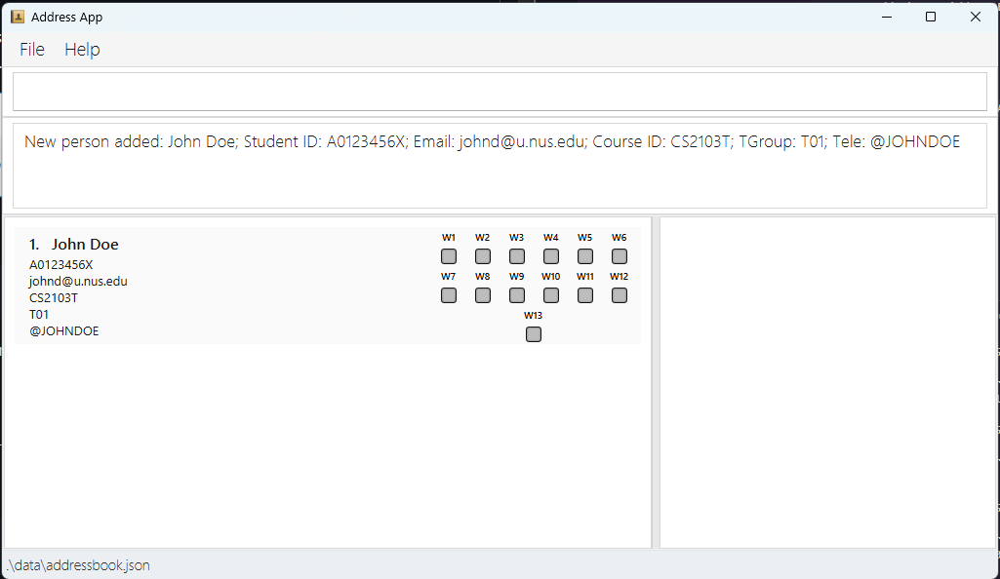
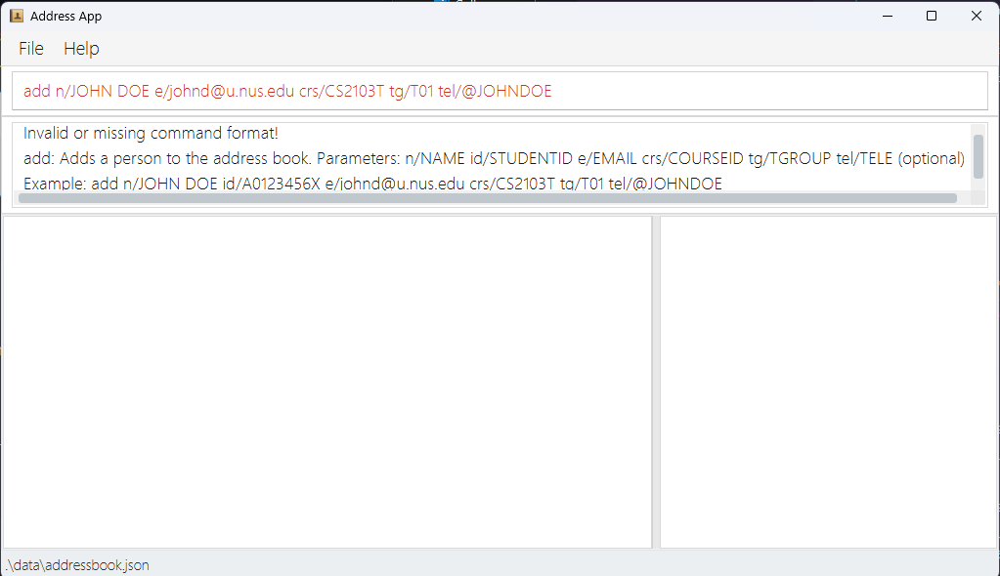
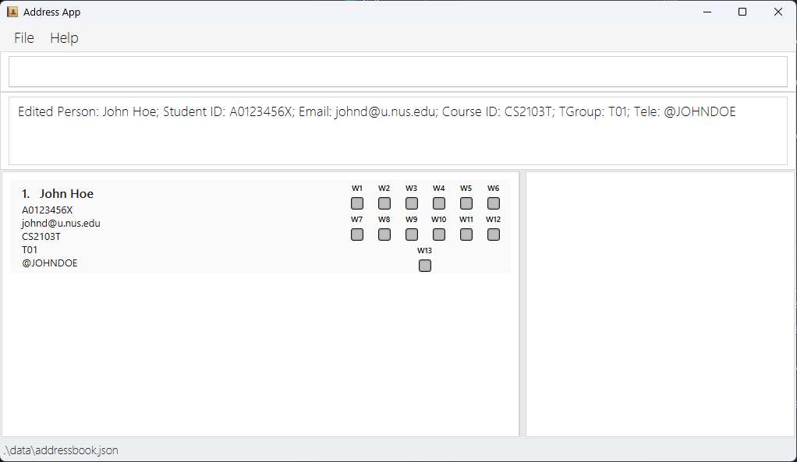
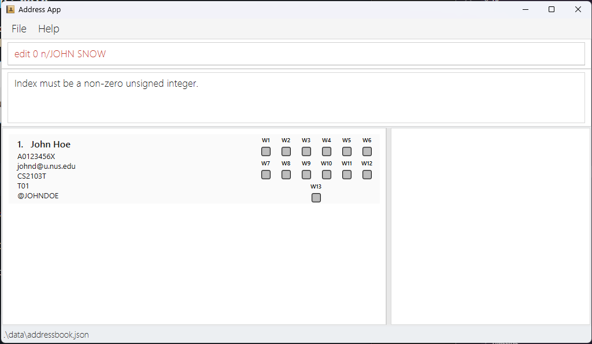
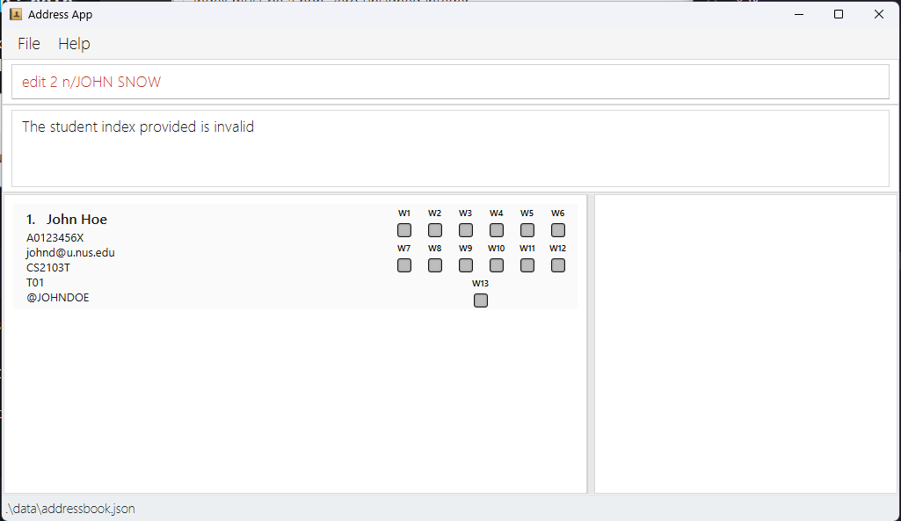
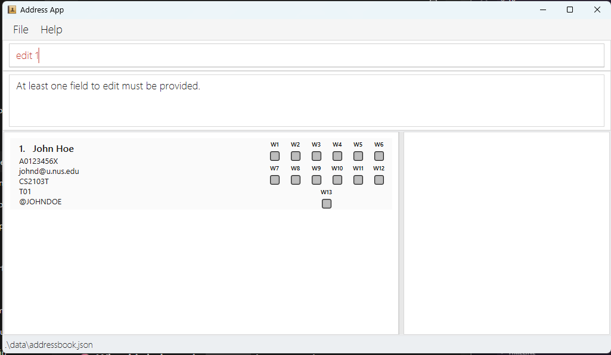
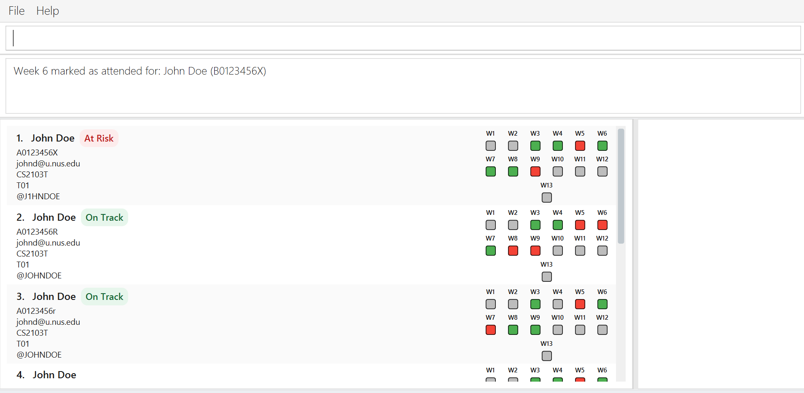
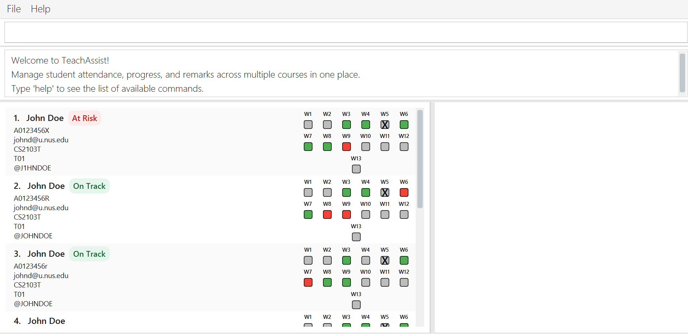

# TeachAssist User Guide

Are you tired of juggling multiple platforms—tracking tutorials, managing attendance and progress, and keeping track of endless student records? Do you find yourself struggling with clunky spreadsheets and endless menus? TeachAssist is for you.

TeachAssist is a desktop application designed for full-time University Teaching Assistants (TAs) at NUS who manage multiple classes and tutorials each semester.If you're a fast typist, TeachAssist can help you quickly filter student lists, track attendance, and log important notes using straightforward keyboard commands, all while offering an easy-to-navigate visual interface.

And the best part? No technical expertise needed—just basic computer skills like installing software and navigating files.

## Table of contents
- [Features](#features)
  - [Viewing help: `help`](#help)
  - [Listing all students: `list`](#list)
  - [Adding a student: `add`](#add)
  - [Finding students by name: `find`](#finding-students-by-name-find)
  - [Filtering students: `filter`](#filter)
  - [Editing a student: `edit`](#edit)
  - [Marking a student's attendance: `markattendance`](#mark-attendance)
  - [Updating a student's progress: `updateprogress`](#update-progress)
  - [Cancelling a tutorial's week: `cancelweek`](#cancel-week)
  - [Unancelling a tutorial's week: `uncancelweek`](#uncancel-week)
  - [Remarks](#remarks)
    - [Adding a remark: `remark`](#remark)
    - [Deleting a remark: `unremark`](#unremark)
  - [Viewing a student: `view`](#view)
  - [Deleting a student: `delete`](#delete)
    - [Delete by index](#deletebyindex)
    - [Delete by student details](#deletebydetails)
  - [Clearing all students: `clear`](#clear)
  - [Exiting the app: `exit`](#exit)
- [Command Summary](#command-summary)
- [Parameter Summary](#parameter-summary)
- [FAQ](#faq)
---
## Quick start

Can't wait to get TeachAssist up and running? Let’s begin!

1. **Ensure that Java 17 or above is installed on your computer.**<br>

   > **To check your Java version:**
   > 1. Open a command terminal on your computer.
   > 2. Type `java -version` and press Enter.
   > 3. Look at the first number in the version shown. It should be `17` or higher.
   >
   > Example:
   > ```bash
   > java -version
   > ```
   > ```bash
   > java version "17.0.1"
   > ```
   >
   > **If Java is not installed, or your version is below 17:**
   > - Install Java 17 using the guide for your operating system:
   >   - [Windows](https://se-education.org/guides/tutorials/javaInstallationWindows.html)
   >   - [Mac](https://se-education.org/guides/tutorials/javaInstallationMac.html)
   >   - [Linux](https://se-education.org/guides/tutorials/javaInstallationLinux.html)
   > - After installation, restart your terminal and run `java -version` again to confirm that the correct version is installed.
  

2. **Download the latest `TeachAssist.jar` file** from the [Releases page](https://github.com/AY2526S2-CS2103T-F10-3/tp/releases/tag/v1.3).

3. **Move the downloaded file into a folder you want to use as the TeachAssist home folder.**  
   This folder will be used to store the app and its data.
   
   Example:
   - You may create a folder named `TeachAssist` on your Desktop.
   - Then move `TeachAssist.jar` into that folder.

4. **Open a terminal in that folder.**
   - Navigate to the folder containing `TeachAssist.jar`.
   - For example, if your folder is named `TeachAssist`, type:
     ```bash
     cd TeachAssist
     ```

5. **Run the application** by entering:
   ```bash
   java -jar TeachAssist.jar
   ```

   After a few seconds, the GUI should appear, similar to the screenshot below.  
   Notice that the app starts with some sample data for you to try out the commands.

   

6. **Try entering a command in the command box.**  
   A good place to start is help. Type it in and press Enter to open the help window and view the list of available commands.

7. **Try these example commands:**
   - `help` : Opens the help window.
   - `list` : Lists all students.
   - `delete 3` : Deletes the student at index `3` in the current list.
   - `add n/John Doe id/A0123456X e/johnd@u.nus.edu crs/CS2103T tg/T01 tel/@johndoe` : Adds a student named `John Doe`.
   - `clear` : Deletes all students.
   - `exit` : Exits the app.

8. **Refer to the [Features](#features) section below** for the full list of commands and detailed usage instructions.

You’re all set! From here, head to the Features section to learn what TeachAssist can do.

---

## Features

<a name="help"></a>
### Viewing help : `help`

If you ever need a quick refresher on TeachAssist features, the Help Window provides a summary of all commands and a direct link to the User Guide.


Format:
```
help
```

<box type="tip">
Tip: You can also press F1 to open the Help window!.
</box>

<a name="list"></a>
### Listing all students: `list`

Lists all students stored sorted in ascending order

Format:
```
list
```


<a name="add"></a>
### Adding a student: `add`

Adds a student. The TELEGRAM_USERNAME field is optional.

Format:
```
add n\NAME id/STUDENT_ID e/EMAIL crs/COURSE_ID tg/TUTORIAL_GROUP [tel/TELEGRAM_USERNAME]
```

Examples:
```
add n/JOHN DOE id/A0123456X e/johnd@u.nus.edu crs/CS2103T tg/T01 tel/@JOHNDOE
```

When done successfully, it should look like this:



If any required fields are missing or the index is wrong, an error will be shown:



<find>

<filter>

<a name="edit"></a>
### Editing a student: `edit`

Edits a student based on the index given. At least one field must be present.

Format:
```
edit [n\NAME] [id/STUDENT_ID] [e/EMAIL] [crs/COURSE_ID] [tg/TUTORIAL_GROUP] [tel/TELEGRAM_USERNAME]
```

Examples:
```
edit 1 n/JOHN HOE
```

When done successfully, it should look like this:



If any required fields are missing or wrong, an error will be shown:







<markattendance>
### Marks a students attendance: `markattendance`

**Update attendance by index, week, status**

Format:
```
markattendance INDEX week/WEEK sta/STATUS
```

* Updates the attendance of student at the specified `INDEX` and `WEEK` to `STATUS`.
* The index refers to the index number shown in the currently displayed student list.
* The index **must be a positive integer** 1, 2, 3, …
* The week referes to school weeks, which are visible to the right of teachassist

**Examples**:
`markattendance 1 week/3 sta/y`
* marks the attendance of the 1st student's attendance in week 3 as present -> Green.

`markattendance 2 week/6 sta/a`
* marks the attendance of the 2nd student's attendance in week 6 as absent -> Red.

`markattendance 4 week/4 sta/n`
* marks the attendance of the 4th student's attendance in week 4 as unmarked -> Grey.

##
<cancelweek>
<a name="cancel-week"></a>
### Cancelling a tutorial's week: `cancelweek`

Marks a specific week as **cancelled** for all students in a given course and tutorial group.

Format:

cancelweek crs/COURSE_ID tg/TUTORIAL_GROUP week/WEEK


* Cancels the specified `WEEK` for **all students** in the matching `COURSE_ID` and `TUTORIAL_GROUP`.
* A cancelled week will be reflected in each student’s attendance record.
* If the week is already cancelled, the command will have no additional effect.
* The cancellation is applied to:
    * Existing students in that course and tutorial group.
    * Future students added to the same course and tutorial group.

**Examples**:

cancelweek crs/CS2103T tg/T01 week/5

* Cancels week 5 for all students in CS2103T tutorial group T01.

##
<uncancelweek>
<a name="uncancel-week"></a>
### Uncancelling a tutorial's week: `uncancelweek`
Reverts a previously cancelled week for a specific course and tutorial group.

Format:

uncancelweek crs/COURSE_ID tg/TUTORIAL_GROUP week/WEEK


* Removes the cancelled status for the specified `WEEK`.
* The week will return to a normal attendance state for all students in the matching course and tutorial group.
* This affects:
    * Existing students (their week status will be updated).
    * Future students (the week will no longer be auto-marked as cancelled).
* If the week was not previously cancelled, the command will have no effect.

**Examples**:

uncancelweek crs/CS2103T tg/T01 week/5

* Restores week 5 as a normal week for all students in CS2103T tutorial group T01.

<a name="update-progress"></a>
### Updating a student's progress : `updateprogress`

Need to quickly flag a student who is doing well, falling behind, or needs closer follow-up? Use `updateprogress` to keep that status up to date.

Format:
```
updateprogress INDEX p/PROGRESS
```

* Updates the progress of the student at the specified `INDEX`.
* The index refers to the index number shown in the currently displayed student list.
* The index **must be a positive integer** `1`, `2`, `3`, …
* Supported progress values:
  * `on_track`
  * `needs_attention`
  * `at_risk`
  * `not_set`
* Progress is case-insensitive, so values such as `ON_TRACK` and `on_track` are both accepted.

<box type="tip">
Tip: To remove a student's progress tag, use `not_set` as the progress value.
</box>

Examples:
```
updateprogress 1 p/on_track
updateprogress 2 p/needs_attention
updateprogress 3 p/not_set
```
The progress tags added should look like the following:


<remark>

### Remarks

<a name="remark"></a>

#### Adding a remark : `remark`

Need to record an important note about a student? Use the `remark` command to attach a remark directly to that student’s record! Keep track of class participation, proficiency in topics, or just general remarks of a student!

Format:
```
remark INDEX txt/REMARK
```

Examples:
```
remark 1 txt/Participates actively in class!
```

Notes:
* The remark must be prefixed with `txt/`.
* If multiple `txt/` prefixes are provided, only the first `txt/` is treated as a prefix, subsequent `txt/` prefixes will be treated as part of the remark
* Each remark is limited to a 100 characters. Keep your remarks concise!

Example:
```
remark 1 txt/Needs more practice on txt/recursion
```
will be stored as `Needs more practice on txt/recursion`


<a name="unremark"></a>

#### Removing a remark : `unremark`

Over time, some remarks may become outdated, unnecessary, or incorrect. The `unremark` feature lets you delete a specific remark from a student’s record when it is no longer useful.

Format:
```
unremark INDEX r/REMARK_INDEX
```

Examples:
```
unremark 1 r/2
```


<view>

<a name="delete"></a>
### Deleting a student: `delete`

Need to remove a student record? TeachAssist lets you do this in two ways. The usual method is to delete by index when the student is already visible in the current list. If needed, you can also delete by the student’s stored details.

<a name="deletebyindex"></a>
#### Delete by index

Use this when the student is already shown in the current list and you want the fastest way to remove them.

Format:
```text
delete INDEX
```

* Deletes the student at the specified `INDEX`.
* The index refers to the index number shown in the currently displayed student list.
* The index **must be a positive integer** `1`, `2`, `3`, …

**Confirmation prompt**

After you enter a valid `delete` command, TeachAssist will show a confirmation message.  
Enter `yes` to proceed with the deletion, or `no` to cancel it.

You should see this confirmation message shown after a valid `delete` command:


**Success message**

Once the deletion is confirmed, TeachAssist will display a success message so you know the student has been successfully removed.


Example:
`delete 1` followed by `yes`
* Deletes the 1st student in the currently displayed student list.

Example:
`delete 3` followed by `no`
* No change is made.

<a name="deletebydetails"></a>
#### Delete by student details

Need a more precise alternative? You can also delete a student by specifying their student ID, course ID, and tutorial group instead of relying on list position.

Format:
```text
delete id/STUDENT_ID crs/COURSE_ID tg/TUTORIAL_GROUP
```

* Deletes the student with the exact matching `STUDENT_ID`, `COURSE_ID`, and `TUTORIAL_GROUP`.
* The same confirmation flow applies: enter `yes` to confirm or `no` to cancel.

<box type="warning">
Warning: This method searches the **entire address book**, not just the students currently shown in the list. This means a student can still be deleted even if they are currently hidden by a filter.
</box>

Example:
`delete id/A1234567X crs/CS2103T tg/T01` followed by `yes`
* Deletes the student with student ID `A1234567X`, course `CS2103T`, and tutorial group `T01`.


<a name="clear"></a>
### Clears all students : `clear`

Deletes all students

Format:
```
clear
```

<a name="exit"></a>
### Exiting the program : `exit`

Exits the program.

Format:
```
exit
```

### Saving the data

TeachAssist data are saved in the hard disk automatically after any command that changes the data. There is no need to save manually.

[end]


<a name="find"></a>
### Finding students by name: `find`

Instantly locate students by typing the beginning of any word in their name.

Format: `find KEYWORD [MORE_KEYWORDS]...`

**Search Rules:**
* The search is case-insensitive. e.g. `hans` matches `Hans`
* The order of keywords does not matter. e.g. `Hans Bo` matches `Bo Hans`
* Only the name field is searched
* Keywords match the **start of words** in names (prefix matching).Substrings in the middle of words are not matched.
    * e.g. `Han` matches `Hans`
    * `an` will not match `Hans`
* If you provide multiple keywords, TeachAssist will find students that match any of them (e.g., find Al Bob finds both Albert and Bobby)

**Example:** `find jo doe` — Finds **Jo**hn **Doe** and **Jo**anne **Doe**bertson.

**Expected Output:**
The student list updates instantly to show only matching records, and the Result Box (see Figure X) displays the total count of students found.

<box type="warning">
Warning: Keywords must be alphabetic only (A–Z). Using numbers or symbols (e.g., `find A123`) will result in an error.
</box>

**Note:** The `find` command searches through the entire stored student list and replaces any existing filter — it does not apply on top of a previously displayed (filtered) list.

<a name="filter"></a>
### Filtering students: `filter`

Narrow down your student list by Course ID, Tutorial Group, Progress, or Absence count. This is the most efficient way to identify "at-risk" students or specific tutorial sections.

Format:
```
filter [crs/COURSE_ID] [tg/TUTORIAL_GROUP] [p/PROGRESS] [abs/ABSENCE_COUNT]`
```

Behaviour:
* Course ID (`crs/`) and tutorial group (`tg/`) are matched case-insensitively.
* Progress (`p/`) must be one of the supported tokens(case insensitive): `on_track`, `needs_attention`, `at_risk`, or `clear` (alias `not_set`).
* Absence count (`abs/`) matches students whose absence count is greater than or equal to the provided number.
* Multiple filters combine with AND semantics — a student must satisfy every provided filter to be included in the results.

**Warning:**At least one filter parameter must be provided; using no parameters will result in an error.
** Note:** the `filter` command applies to the entire stored student list and replaces any existing filter — it does not apply on top of a previously displayed (filtered) list.

Examples:
* `filter crs/CS2103T` — returns students enrolled in CS2103T.
* `filter crs/CS2103T tg/T01` — returns students in CS2103T and tutorial group T01.
* `filter p/on_track` — returns students whose progress is `on_track`.
* `filter abs/2` — returns students with 2 or more absences.
* `filter crs/CS2103T tg/T02 p/needs_attention abs/1` — returns students matching all four criteria.

**Examples:**

filter crs/CS2103T — Returns all students enrolled in CS2103T.

filter crs/CS2103T tg/T01 — Returns students in CS2103T and tutorial group T01.

filter abs/2 — Returns students with 2 or more absences.

filter crs/CS2103T tg/T02 p/needs_attention abs/1 — Returns students matching all four criteria.

**Expected Output:**
The student list updates instantly. The Result Box will display the total count:

`There are 5 students matching this filter.`

**Tip:** if a filter returns no results, verify you used the correct course ID/tutor group format and valid progress values; run `help` or check the Update Progress section for exact progress tokens.

##

<a name="edit"></a>
### Editing a student: `edit`

Edit fields of the students at the given index. At least one field to edit must be provided.

Format:
```
edit INDEX [n/NAME] [id/STUDENT_ID] [e/EMAIL] [crs/COURSE_ID] [tg/TUTORIAL_GROUP] [tel/TELEGRAM_USERNAME]
```

Examples:
* `edit 1 n/John Tan` - Edits the name of the 1st student to `John Tan`.
* `edit 2 e1384397@u.nus.edu` - Edits the email of the 2nd student.
* `edit 3 tel/@john_tan` - Edits the Telegram username of the 3rd student.
* `edit 4 crs/CS2103T tg/T03` - Edits the course ID and tutorial group of the 4th student.
* `edit 5 n/John Tan e1384397@u.nus.edu` - Edits the name and email of the 5th student.
* `edit 6 id/A1234567B crs/CS2040S tg/T12` - Edits the student ID, course ID, and tutorial group of the 6th student.
* `edit 7 n/John Tan id/A1234567B e1384397@u.nus.edu crs/CS2105 tg/T08 tel/@john_tan` - Edits all editable fields of the 7th student.

##

<a name="view"></a>
### Viewing a student: `view`

If you need to see a student's remarks history, use the view command to display their information in the side panel.

Format:
```
view INDEX
```
**Example:** `view 1` — Displays the full details of the first student in the list.

**Expected Output:**
The **View Window** on the right side of the application updates to show the selected student's details. A confirmation message also appears in the Result Box:
> `Viewing student: John Doe; ID: A0123456X; ...`

**Note** The `view` command works on the *currently filtered* list. If you have filtered the list to show only "At Risk" students, `view 1` will show the first student in that filtered sub-list.

<box type="warning">
**Warning:** If the index provided is larger than the number of students currently visible (e.g., typing `view 10` when only 5 students are listed), TeachAssist will show an "Invalid index" error.
</box>

<a name="mark-attendance"></a>


<a name="update-progress"></a>
### Updating a student's progress : `updateprogress`

Updates a student's progress.

Format:
```
updateprogress INDEX p/PROGRESS
```

* Supported progress values:
  * `on_track`
  * `needs_attention`
  * `at_risk`
  * `not_set` (alias: `clear`)

* Parsing is case-insensitive (e.g `ON_TRACK` and `on_track` are both accepted)
* To remove a progress tag use `not_set` or `clear`.

Examples:
```
updateprogress 1 p/on_track
```

<a name="progressbydetails"></a>
**Update progress by student details**

Format:
```
updateprogress id/STUDENT_ID crs/COURSE_ID tg/TUTORIAL_GROUP p/PROGRESS
```

* Updates the progress of the student with the exact details match for `STUDENT_ID`, `COURSE_ID`, and `TUTORIAL_GROUP` to `PROGRESS`.

**Examples**:
* `updateprogress 1 p/on_track` - Sets the progress of the 1st student in the currently displayed student list to `on_track`.
* `updateprogress id/A1234567X crs/CS2103T tg/T01 p/needs_attention` - Sets the progress of the student with student ID A1234567X, course CS2103T, and tutorial group T01 to `needs_attention`.
* `updateprogress 2 p/not_set` - Clears the progress status of the 2nd student in the currently displayed student list.

##


<div markdown="span" class="alert alert-primary"></div>
:bulb: **Tip:**<br><br>

<a name='remark'></a>
### Adding a remark: `remark`

* Adds a remark to the student at a particular index

<a name="attendancebyindex"></a>
**Update attendance by index, week, status**

Format:
```
markattendance INDEX week/WEEK sta/STATUS
```

* Updates the attendance of student at the specified `INDEX` and `WEEK` to `STATUS`.
* The index refers to the index number shown in the currently displayed student list.
* The index **must be a positive integer** 1, 2, 3, …
* The week referes to school weeks, which are visible to the right of teachassist

**Examples**:
`markattendance 1 week/3 sta/y`
* marks the attendance of the 1st student's attendance in week 3 as present -> Green.

`markattendance 2 week/6 sta/a`
* marks the attendance of the 2nd student's attendance in week 6 as absent -> Red.

`markattendance 4 week/4 sta/n`
* marks the attendance of the 4th student's attendance in week 4 as unmarked -> Grey.

<a name='unremark'></a>
### Deleting a remark: `unremark`

* Removes the remark of a student at a particular index


--------------------------------------------------------------------------------------------------------------------

## Command summary

Action     | Format, Examples
-----------|----------------------------------------------------------------------------------------------------------------------------------------------------------------------
**Add**    | `add n/NAME p/PHONE_NUMBER e/EMAIL a/ADDRESS [t/TAG]…​` <br> e.g., `add n/James Ho p/22224444 e/jamesho@example.com a/123, Clementi Rd, 1234665 t/friend t/colleague`
**Clear**  | `clear`
**Delete** | `delete INDEX`<br> e.g., `delete 3`<br> or alternatively,  `delete id/STUDENT_ID crs/COURSE_ID tg/TUTORIAL_GROUP`<br> e.g., `delete id/A1234567X crs/CS2103T tg/T01`
**Edit**   | `edit INDEX [n/NAME] [p/PHONE_NUMBER] [e/EMAIL] [a/ADDRESS] [t/TAG]…​`<br> e.g.,`edit 2 n/James Lee e/jameslee@example.com`
**Find**   | `find KEYWORD [MORE_KEYWORDS]`<br> e.g., `find James Jake`
**List**   | `list`
**Help**   | `help`
**Update Progress** | `updateprogress INDEX p/PROGRESS`<br> e.g., `progress 1 p/on_track`<br> or alternatively, `updateprogress id/STUDENT_ID crs/COURSE_ID tg/TUTORIAL_GROUP p/PROGRESS`<br> e.g., `progress id/A1234567X crs/CS2103T tg/T01 p/needs_attention`


--------------------------------------------------------------------------------------------------------------------

## FAQ

**Q: Do I need to enter parameters in a fixed order?**
No. For commands with prefixes such as add and filter, parameters can be entered in any order as long as all required fields are provided.

**Q: Why did delete 1 remove a different student than I expected?**
Because the index refers to the current displayed list. You may be referring to an outdated list.
